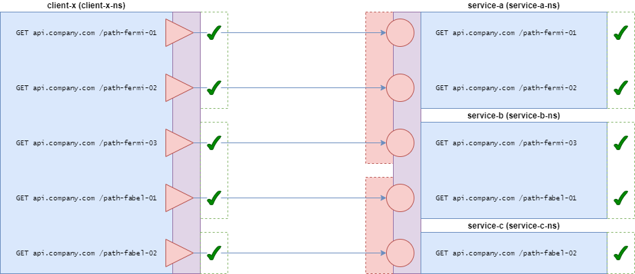

# Scenario 6 - Complex routing to the "right" _service/implementation_ depending on the _API endpoint_, showing the many-to-many relationship between _APIs_ and _services/implementations_

## Description

> _**Warning**_: This scenario does NOT include any "versioning" discussion in order to focus on the _API endpoint_ based routing!

Let's have an _API_, called `Fermi API`, with three _API endpoints_:

* `get api.company.com /path-fermi-01`
* `get api.company.com /path-fermi-02`
* `get api.company.com /path-fermi-03`

Let's have another _API_, called `Fabel API`, with two _API endpoints_:

* `get api.company.com /path-fabel-01`
* `get api.company.com /path-fabel-02`

Let's have a _service/implementation_, called `service-a`, which is **authorized to implement** the following two _API endpoints_:

* `get api.company.com /path-fermi-01`, as defined in `Fermi API`
* `get api.company.com /path-fermi-02`, as defined in `Fermi API`

Let's have a _service/implementation_, called `service-b`, which is **authorized to implement** the following two _API endpoints_, coming from two different _APIs_:

* `get api.company.com /path-fermi-03`, as defined in `Fermi API`
* `get api.company.com /path-fabel-01`, as defined in `Fabel API`

Let's finally have a _service/implementation_, called `service-c`, which is **authorized to implement** the following _API endpoint_:

* `get api.company.com /path-fabel-02`, as defined in `Fabel API`

Let's have a _service_, called `client-x`, which is **authorized to call** all the _API endpoints_:

* `get api.company.com /path-fermi-01`, as defined in `Fermi API`
* `get api.company.com /path-fermi-02`, as defined in `Fermi API`
* `get api.company.com /path-fermi-03`, as defined in `Fermi API`
* `get api.company.com /path-fabel-01`, as defined in `Fabel API`
* `get api.company.com /path-fabel-02`, as defined in `Fabel API`

With a service mesh properly configured, we should have the following traffic:

```text
s6-client-x -- get api.company.com /path-fermi-01 -----> 200 | s6-service-a
s6-client-x -- get api.company.com /path-fermi-02 -----> 200 | s6-service-a
s6-client-x -- get api.company.com /path-fermi-03 -----> 200 | s6-service-b
s6-client-x -- get api.company.com /path-fabel-01 -----> 200 | s6-service-b
s6-client-x -- get api.company.com /path-fabel-02 -----> 200 | s6-service-c
```

You can find below a graphical representation of this situation:



*Fig. 6.1: Scenario 6*

## Demo with Kubernetes and Istio (1.9)

### Install Istio

#### Download Istio

```text
$ curl -L https://istio.io/downloadIstio | sh -
...
$ cd istio-1.9.1/
$ export PATH=$PWD/bin:$PATH
$ cd ..
$ istioctl version
no running Istio pods in "istio-system"
1.9.1
```

#### Install with Istio Operator

1\. Deploy the Istio operator:

```text
$ istioctl operator init
Installing operator controller in namespace: istio-operator using image: docker.io/istio/operator:1.9.1
Operator controller will watch namespaces: istio-system
✔ Istio operator installed
✔ Installation complete
```

2\. Install Istio by creating an Istio operator:

```text
$ kubectl create ns istio-system
$ kubectl apply -f - <<EOF
apiVersion: install.istio.io/v1alpha1
kind: IstioOperator
metadata:
  name: the-istio-operator
  namespace: istio-system
spec:
  profile: default
  meshConfig:
    defaultConfig:
      proxyMetadata:
        ISTIO_META_DNS_CAPTURE: "true"
        ISTIO_META_DNS_AUTO_ALLOCATE: "true"
EOF
```

3\. Verify the installation:

```text
kubectl get pods -n istio-system
NAME                                  READY   STATUS    RESTARTS   AGE
istio-ingressgateway-848fc5df-hmqll   1/1     Running   0          87s
istiod-64df8d496d-z9wfs               1/1     Running   0          99s
```

### Install Scenario 6

1\. Install:

```text
$ kubectl apply -f scenario-06.k8s-and-istio.yaml
namespace/service-a-ns created
serviceaccount/service-a-sa created
deployment.apps/service-a-deployment created
service/service-a created
namespace/service-b-ns created
serviceaccount/service-b-sa created
deployment.apps/service-b-deployment created
service/service-b created
namespace/service-c-ns created
serviceaccount/service-c-sa created
deployment.apps/service-c-deployment created
service/service-c created
namespace/client-x-ns created
serviceaccount/client-x-sa created
deployment.apps/client-x-deployment created
peerauthentication.security.istio.io/strict-peer-authentication created
authorizationpolicy.security.istio.io/deny-all-authorization-policy created
serviceentry.networking.istio.io/api-company-com-service-entry created
virtualservice.networking.istio.io/api-company-com-virtual-service created
authorizationpolicy.security.istio.io/client-x-to-service-a-authorization-policy created
authorizationpolicy.security.istio.io/client-x-to-service-b-authorization-policy created
authorizationpolicy.security.istio.io/client-x-to-service-c-authorization-policy created
```

2\. Verify the installation:

```text
$ kubectl get pods -A
NAMESPACE        NAME                                    READY   STATUS    RESTARTS   AGE
...
client-x-ns      client-x-deployment-797f9ccc94-8w9gf    2/2     Running   0          30s
...
service-a-ns     service-a-deployment-68799dcc4f-6n9md   2/2     Running   0          30s
service-b-ns     service-b-deployment-854ff9c7cd-9z4tl   2/2     Running   0          30s
service-c-ns     service-c-deployment-8c987f45c-8dwxk    2/2     Running   0          30s
...
```

3\. Check the logs of `client-x`:

```text
$ kubectl logs client-x-deployment-797f9ccc94-8w9gf client-x-co -n client-x-ns --tail 20
...
[INFO_] GET api.company.com:80 /path-fermi-01 | 200 | Hello from GET /path-fermi-01 | service-a (0.1.0) | service-a-deployment-68799dcc4f-6n9md
[INFO_] GET api.company.com:80 /path-fermi-02 | 200 | Hello from GET /path-fermi-02 | service-a (0.1.0) | service-a-deployment-68799dcc4f-6n9md
[INFO_] GET api.company.com:80 /path-fermi-03 | 200 | Hello from GET /path-fermi-03 | service-b (0.1.0) | service-b-deployment-854ff9c7cd-9z4tl
[INFO_] GET api.company.com:80 /path-fabel-01 | 200 | Hello from GET /path-fabel-01 | service-b (0.1.0) | service-b-deployment-854ff9c7cd-9z4tl
[INFO_] GET api.company.com:80 /path-fabel-02 | 200 | Hello from GET /path-fabel-02 | service-c (0.1.0) | service-c-deployment-8c987f45c-8dwxk
...
```
